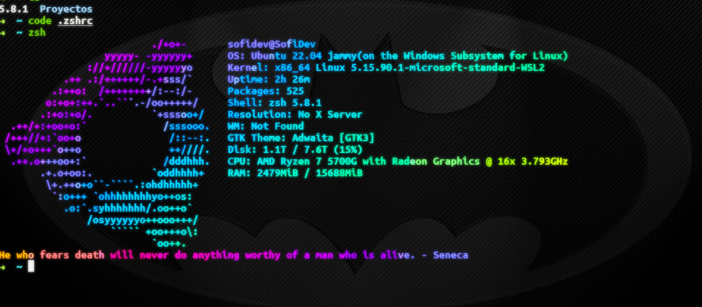
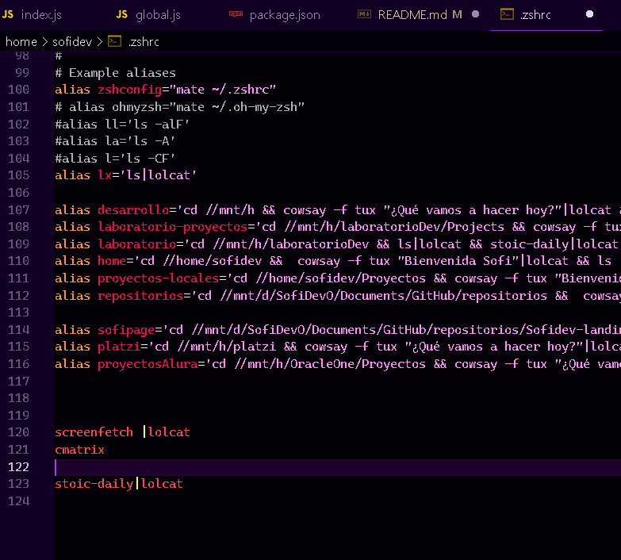

# stoic-daily
NPM package that displays stoic quotes for daily motivation.


### Yo can add it to your personal aliases

Added to the .bashrc or .zshrc to display at startup or whenever you want.




## Install

```npm
sudo npm install -g stoic-daily

```

# Usage

```bash
stoic-daily
```

# Contributing

If someone wants to add or improve something, I invite you to collaborate directly in this repository: [stoic-daily](https://www.npmjs.com/package/stoic-daily)

# License

stoic-daily  is released under the [MIT License](https://opensource.org/licenses/MIT).